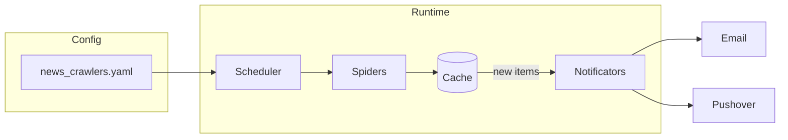

# News Crawlers

**An extensible Python web crawler framework that monitors websites for new content and sends notifications via Email or Pushover.**

[](https://github.com/jprevc/news_crawlers/actions/workflows/main.yml)
[](https://www.python.org/downloads/)
[](https://opensource.org/licenses/MIT)
[](https://pypi.org/project/news_crawlers/)
[](https://codecov.io/gh/jprevc/news_crawlers)

## Overview

News Crawlers runs spiders that crawl configured websites (e.g. classifieds, car listings) for new items. When new content is found, it alerts you via Email (Gmail SMTP) or Pushover. You can run crawlers once or on a schedule, and extend the framework with custom spiders.

## Features

- **Scheduling** — Run crawlers periodically (e.g. every 15 minutes) via a `schedule` section in config.
- **Multiple notificators** — Email (Gmail) and Pushover; mix and match per spider with configurable message formats.
- **Extensible spiders** — Add custom spiders in `spiders.py`; each yields items whose keys match your `message_body_format` placeholders.
- **Dockerized** — Suitable for containerized deployment (images published on Docker Hub).

## Architecture



Flow: configuration is read from `news_crawlers.yaml`. The scheduler (if configured) runs the spiders at the specified interval. Spiders fetch pages, parse items, and check the cache for already-seen entries. New items trigger notifications via the configured channels (Email and/or Pushover).

## Installation

Install from PyPI:

```bash
python -m pip install news_crawlers
```

Run from the CLI and view help:

```bash
python -m news_crawlers -h
```

## Configuration

Configuration is defined in a **`news_crawlers.yaml`** file.

### Config file path

Pass the path via CLI:

```bash
python -m news_crawlers -c /path/to/news_crawlers.yaml
```

If not provided, the app looks for the file in a `config` directory (if present) and in the current working directory.

### Cache location

When a spider runs, it stores seen items in a `.nc_cache` directory. Override the default location with:

```bash
python -m news_crawlers --cache /path/to/data
```

If not specified, the cache is stored in `data/.nc_cache` relative to the current working directory.

### Spiders and URLs

In the config file, define a **`spiders`** section listing each spider and its settings. Example:

```yaml
spiders:
  bolha:
    notifications:
      email:
        email_user: "__env_EMAIL_USER"
        email_password: "__env_EMAIL_PASS"
        recipients: ['jost.prevc@gmail.com']
        message_body_format: "Query: {query}\nURL: {url}\nPrice: {price}\n"
      pushover:
        recipients: ['ukdwndomjog3swwos57umfydpsa2sk']
        send_separately: True
        message_body_format: "Query: {query}\nPrice: {price}\n"
    urls:
      'pet_prijateljev': https://www.bolha.com/?ctl=search_ads&keywords=pet+prijateljev
      'enid_blyton': https://www.bolha.com/?ctl=search_ads&keywords=enid%20blyton
```

- The spider key (e.g. `bolha`) must match the **`name`** attribute of a spider class in `news_crawlers/spiders.py`.
- Each spider must have **`notifications`** and **`urls`**. Notifications define how you are alerted when new items are found for the given URLs.

### Environment variables

Prefix any config value with **`__env_`** to read it from the environment. For example, `__env_EMAIL_USER` is replaced with the value of the `EMAIL_USER` environment variable. Use this to avoid storing secrets in the config file.

### Schedule

To run crawlers on a schedule, add a **`schedule`** section:

```yaml
schedule:
  every: 15
  units: minutes
```

### Example full config

```yaml
schedule:
  every: 15
  units: minutes
spiders:
  bolha:
    notifications:
      email:
        email_user: "__env_EMAIL_USER"
        email_password: "__env_EMAIL_PASS"
        recipients: ['jost.prevc@gmail.com']
        message_body_format: "Query: {query}\nURL: {url}\nPrice: {price}\n"
      pushover:
        recipients: ['ukdwndomjog3swwos57umfydpsa2sk']
        send_separately: True
        message_body_format: "Query: {query}\nPrice: {price}\n"
    urls:
      'pet_prijateljev': https://www.bolha.com/?ctl=search_ads&keywords=pet+prijateljev
      'enid_blyton': https://www.bolha.com/?ctl=search_ads&keywords=enid%20blyton
```

## Notification configuration

Two notification backends are supported: **Email** (Gmail SMTP) and **Pushover**.

### Email

1. Create an [App Password](https://myaccount.google.com/apppasswords) for your Gmail account.
2. Put the username and password in the config, or reference them via `__env_` (see above).

### Pushover

1. Sign up at [Pushover](https://pushover.net/signup) and note your **user token**.
2. Register your app at [Pushover Apps](https://pushover.net/apps/build) and get an **API token**.
3. Put the user token(s) and API token in the config (or use `__env_` for secrets).
4. Install the [Pushover app](https://pushover.net/) on your device(s) to receive notifications.

Trial expires after 30 days; a one-time purchase is required to continue. See [Pushover pricing](https://pushover.net/pricing).

- [Android](https://play.google.com/store/apps/details?id=net.superblock.pushover)
- [App Store](https://apps.apple.com/us/app/pushover-notifications/id506088175)

## Running the crawlers

Run all configured spiders:

```bash
python -m news_crawlers scrape
```

Run a single spider:

```bash
python -m news_crawlers scrape -s bolha
```

If new items are found, configured notifications are sent.

## Adding custom spiders

1. Open **`news_crawlers/spiders.py`**.
2. Add a class that subclasses **`Spider`**.
3. Implement crawling so the spider **yields** item dicts. The keys of each dict must match the placeholders used in the **`message_body_format`** strings in your config (e.g. `query`, `url`, `price`).

## Development setup

Clone the repository:

```bash
git clone https://github.com/jprevc/news_crawlers.git
cd news_crawlers
```

Install in development mode (with dev dependencies) and run tests:

```bash
python -m pip install -e ".[dev]"
tox
```
